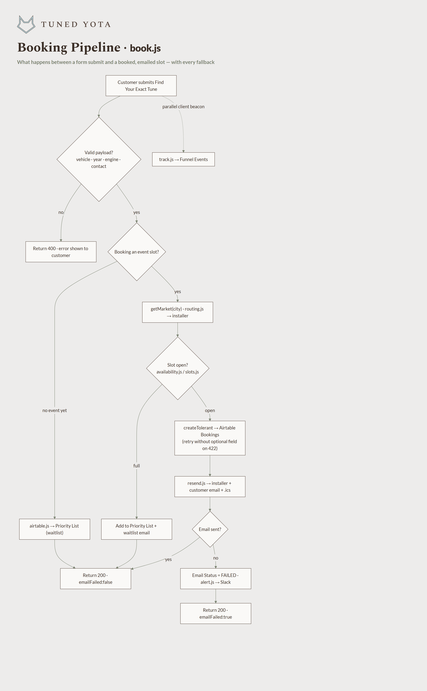
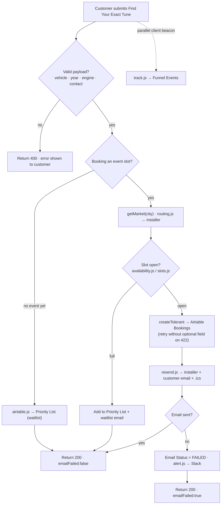

# Tuned Yota — Booking Pipeline (`book.js`)

A deeper zoom into stage ③ of the [end-to-end workflow](tuned-yota-workflow.md): exactly
what `netlify/functions/book.js` does between a form submit and a booked, emailed slot —
including every fallback that keeps a booking from being lost. Regenerate the PNG with
`node docs/architecture/render-workflow.js`.

## Design notes
- **Best-effort, never lose a booking.** `createTolerant` retries the Airtable write without
  an optional field if the column is missing (422), so a schema gap never drops a booking.
- **Email failure is non-fatal.** A failed send still returns 200, flags `Email Status=FAILED`,
  and alerts Slack — so the booking persists and the owner is told to follow up manually.
- **No event yet → waitlist.** Leads for cities without a scheduled event land on the Priority
  List and are swept into the next event (and into `event-reminders.js`).
- **Tracking is a separate path.** `track.js` beacons fire client-side into Funnel Events,
  independent of the booking write — so analytics never block or break a booking.
