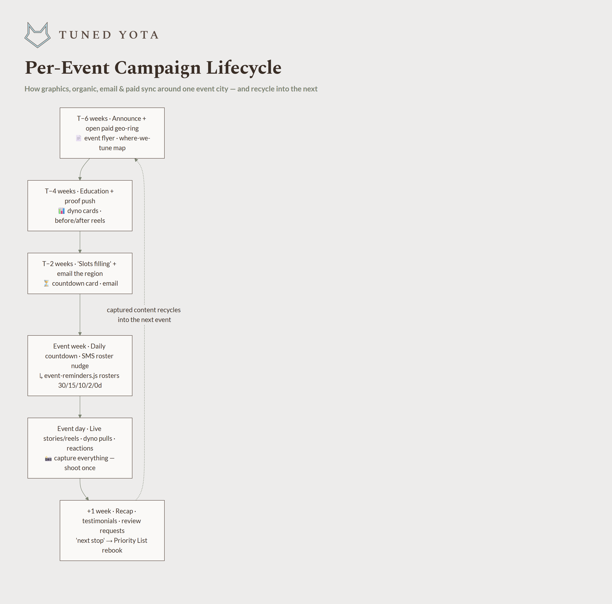
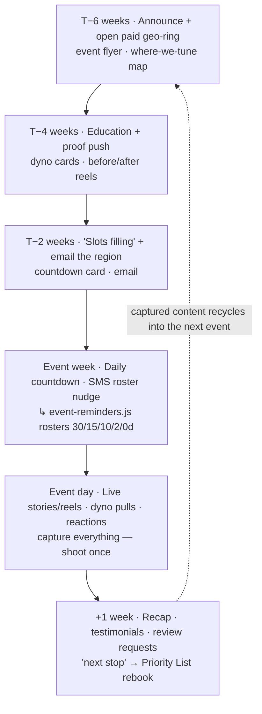

# Tuned Yota — Per-Event Campaign Lifecycle

A deeper zoom into stages ①+④+⑤ of the [end-to-end workflow](tuned-yota-workflow.md): the
repeatable rhythm that runs for **every event city** in
[`docs/events/2026-2027-event-plan.md`](../events/2026-2027-event-plan.md), syncing graphics,
organic posts, email, and paid — and recycling the captured content into the next event.
This is the operational form of §8 of the
[master advertising plan](../marketing/master-advertising-plan.md). Regenerate the PNG with
`node docs/architecture/render-workflow.js`.

## Where the pieces come from
- **Graphics** → the [ad-template kit](../marketing/ad-templates/) (event flyer per city/UTM,
  dyno cards, countdown, testimonial, recap).
- **Roster automation** → `event-reminders.js` already fires installer rosters + customer
  notices on its own schedule; the campaign rides alongside it.
- **Email/SMS** → the region's Airtable list (booked + Priority List).
- **Review engine** → the +1-week step is where Google reviews get asked for (the local-ranking
  lever) and testimonials get filmed → both recycle to the top of the funnel.
