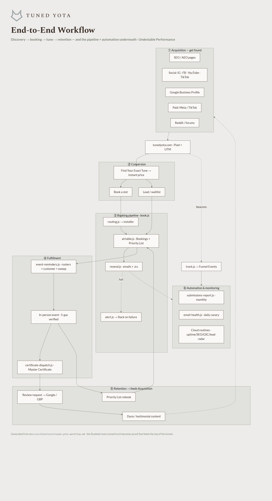
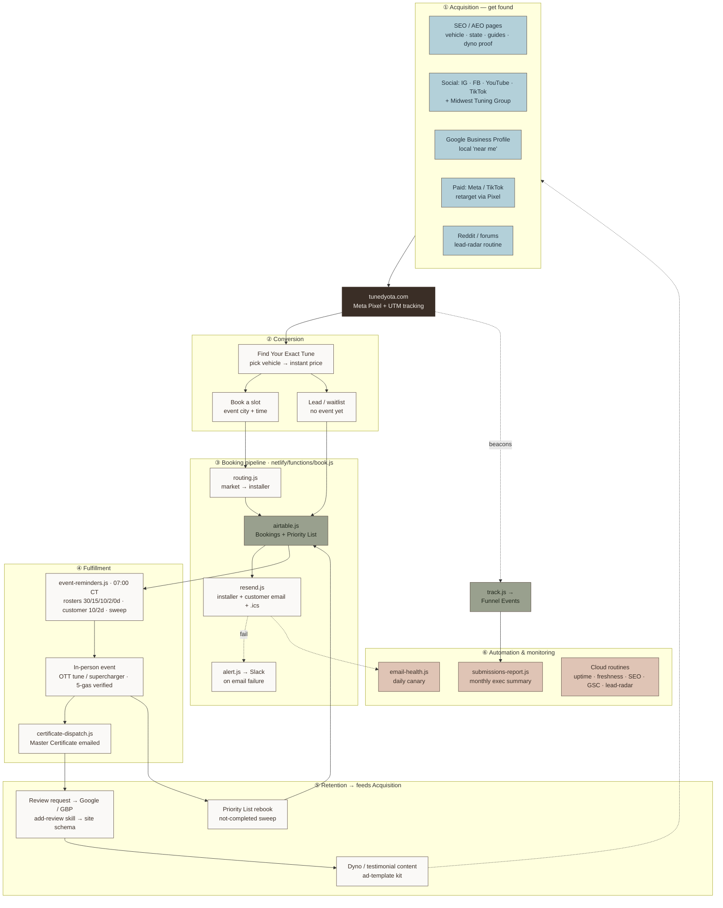

# Tuned Yota — End-to-End Workflow

How the whole system fits together, from a stranger discovering the brand to a tuned
customer who comes back and refers others — and the technical pipeline + automation
underneath it. The Mermaid below renders visually on GitHub; a portable brand-styled
PNG is committed at [`tuned-yota-workflow.png`](tuned-yota-workflow.png) (regenerate with
`node docs/architecture/render-workflow.js`).

## How to read it
1. **Acquisition** — every channel exists to drive traffic to the site (each with a UTM).
2. **Conversion** — Find Your Exact Tune turns a visitor into a booking or a waitlist lead; `track.js` logs the funnel.
3. **Booking pipeline** — `book.js` routes to the right installer, writes Airtable, sends emails + calendar invite, and alerts Slack only if email fails.
4. **Fulfillment** — scheduled reminders fill the roster; the event happens; the Master Certificate goes out.
5. **Retention** — reviews, rebooks, and content loop straight back into Acquisition — the flywheel.
6. **Automation** — monitoring + reporting keep the whole thing honest without manual checking.

**The flywheel:** every tuned truck becomes proof (dyno, testimonial, review) that feeds
the top of the funnel — which is exactly what the master advertising plan operationalizes.
